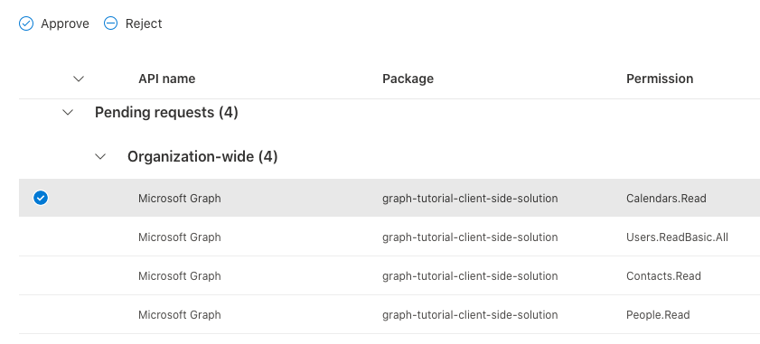

# <a name="how-to-run-the-completed-project"></a>Vorgehensweise Ausführen des abgeschlossenen Projekts

## <a name="prerequisites"></a>Voraussetzungen

Um das abgeschlossene Projekt in diesem Ordner auszuführen, benötigen Sie Folgendes:

- [Node.js](https://nodejs.org/en/download/releases/) Version 10. x
- [Gulp](https://gulpjs.com/)
- Ein Microsoft-Arbeits-oder Schulkonto mit Zugriff auf ein globales Administratorkonto in derselben Organisation. Wenn Sie kein Microsoft-Konto haben, können Sie [sich für das Office 365 Entwicklerprogramm registrieren](https://developer.microsoft.com/office/dev-program) , um ein kostenloses Office 365-Abonnement zu erhalten.
- Ihr Microsoft 365-Mandant sollte [für die SharePoint Framework-Entwicklung eingerichtet](https://docs.microsoft.com/sharepoint/dev/spfx/set-up-your-developer-tenant)sein, wobei ein App-Katalog und eine TestWebsite erstellt wurden, bevor Sie mit diesem Lernprogramm beginnen.

### <a name="deploy-the-web-part"></a>Bereitstellen des Webparts

1. Führen Sie die folgenden beiden Befehle in der CLI aus, um das Webpart zu erstellen und zu verpacken.

    ```Shell
    gulp bundle --ship
    gulp package-solution --ship
    ```

1. Öffnen Sie den Browser, und wechseln Sie zum SharePoint-App-Katalog des Mandanten. Wählen Sie auf der linken Seite das Menüelement **Apps für SharePoint** aus.

1. Laden Sie die Datei **./SharePoint/Solution/Graph-Tutorial.sppkg** hoch.

1. Bestätigen Sie in der Aufforderung **Do You Trust...** , dass in der Aufforderung die vier Microsoft Graph-Berechtigungen aufgelistet sind, die Sie in der Datei **package-solution.jsfür** festgelegt haben. Wählen Sie **Diese Lösung für alle Websites in der Organisation verfügbar machen** aus, und wählen Sie dann **Bereitstellen** aus.

1. Wechseln Sie zum [SharePoint Admin Center](https://admin.microsoft.com/sharepoint?page=classicfeatures&modern=true) mithilfe eines Mandanten Administrators.

1. Wählen Sie im Menü links die Option **erweitert** und dann **API-Zugriff** aus.

1. Wählen Sie die ausstehenden Anforderungen aus dem Paket **Graph-Tutorial-Client-Side-Solution** aus, und wählen Sie **genehmigen** aus.

    

### <a name="test-the-web-part"></a>Testen des Webparts

1. Wechseln Sie zu einer SharePoint-Website, auf der Sie das Webpart testen möchten. Erstellen Sie eine neue Seite, auf der das Webpart getestet werden soll.

1. Verwenden Sie die Webpart-Auswahl zum Suchen des **GraphTutorial** -Webparts und zum Hinzufügen des Webparts zur Seite.

    
