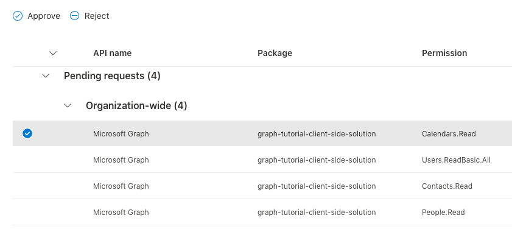
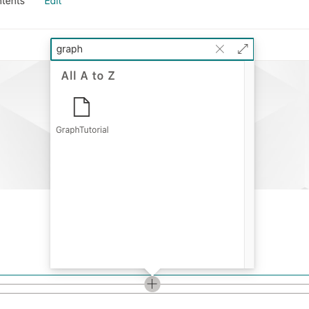

<!-- markdownlint-disable MD002 MD041 -->

Das SharePoint-Framework entfällt die Notwendigkeit, eine Anwendung in Azure AD für das Abrufen von Zugriffstoken für den Zugriff auf Microsoft Graph zu registrieren. Er behandelt die Authentifizierung für den Benutzer, der bei SharePoint angemeldet ist, sodass das Webpart Benutzertoken erhalten kann. Das Webpart muss angeben, welche [Graph-Berechtigungs Bereiche](https://docs.microsoft.com/graph/permissions-reference) benötigt werden, und ein mandantenadministrator kann diese Berechtigungen während der Installation genehmigen.

## <a name="configure-permissions"></a>Konfigurieren von Berechtigungen

1. Öffnen Sie **./config/package-solution.jsein**.

1. Fügen Sie der-Eigenschaft den folgenden Code hinzu `solution` .

    ```json
    "webApiPermissionRequests": [
      {
        "resource": "Microsoft Graph",
        "scope": "Calendars.ReadWrite"
      },
      {
        "resource": "Microsoft Graph",
        "scope": "User.ReadBasic.All"
      },
      {
        "resource": "Microsoft Graph",
        "scope": "Contacts.Read"
      },
      {
        "resource": "Microsoft Graph",
        "scope": "People.Read"
      }
    ]
    ```

Die `Calendars.ReadWrite` Berechtigung ermöglicht Ihrem Webpart das Abrufen des Kalenders des Benutzers und das Hinzufügen von Ereignissen mithilfe von Microsoft Graph. Die anderen Berechtigungen werden von Komponenten im Microsoft Graph-Toolkit verwendet, um Informationen zu Ereignis Teilnehmern und Organisatoren zu rendern.

## <a name="optional-test-token-acquisition"></a>Optional: Testen der Token-Erfassung

> [!NOTE]
> Die restlichen Schritte auf dieser Seite sind optional. Wenn Sie direkt zur Microsoft Graph-Codierung gelangen möchten, können Sie fortfahren, um [eine Kalenderansicht zu erhalten](/graph/tutorials/spfx?tutorial-step=3).

Wir fügen dem Webpart einen temporären Code hinzu, um die Token-Akquisition zu testen.

1. Öffnen Sie **/src/Webparts/graphTutorial/GraphTutorialWebPart.TS** , und fügen Sie die folgende `import` Anweisung am Anfang der Datei hinzu.

    ```typescript
    import { AadTokenProvider } from '@microsoft/sp-http';
    ```

1. Ersetzen Sie die vorhandene `render`-Funktion durch Folgendes.

    ```typescript
    public render(): void {
    this.context.aadTokenProviderFactory
      .getTokenProvider()
      .then((provider: AadTokenProvider)=> {
      provider
        .getToken('https://graph.microsoft.com')
        .then((token: string) => {
          this.domElement.innerHTML = `
          <div class="${ styles.graphTutorial }">
            <div class="${ styles.container }">
              <div class="${ styles.row }">
                <div class="${ styles.column }">
                  <span class="${ styles.title }">Welcome to SharePoint!</span>
                  <p><code style="word-break: break-all;">${ token }</code></p>
                </div>
              </div>
            </div>
          </div>`;
        });
      });
    }
    ```

### <a name="deploy-the-web-part"></a>Bereitstellen des Webparts

1. Führen Sie die folgenden beiden Befehle in der CLI aus, um das Webpart zu erstellen und zu verpacken.

    ```Shell
    gulp bundle --ship
    gulp package-solution --ship
    ```

1. Öffnen Sie den Browser, und wechseln Sie zum SharePoint-App-Katalog des Mandanten. Wählen Sie auf der linken Seite das Menüelement **Apps für SharePoint** aus.

1. Laden Sie die Datei **./SharePoint/Solution/Graph-Tutorial.sppkg** hoch.

1. Bestätigen Sie in der Aufforderung **Do You Trust...** , dass in der Aufforderung die vier Microsoft Graph-Berechtigungen aufgelistet sind, die Sie in der Datei **package-solution.jsfür** festgelegt haben. Wählen Sie **Diese Lösung für alle Websites in der Organisation verfügbar machen** aus, und wählen Sie dann **Bereitstellen** aus.

1. Wechseln Sie zum [SharePoint Admin Center](https://admin.microsoft.com/sharepoint?page=classicfeatures&modern=true) mithilfe eines Mandanten Administrators.

1. Wählen Sie im Menü links die Option **erweitert** und dann **API-Zugriff** aus.

1. Wählen Sie die ausstehenden Anforderungen aus dem Paket **Graph-Tutorial-Client-Side-Solution** aus, und wählen Sie **genehmigen** aus.

    

### <a name="test-the-web-part"></a>Testen des Webparts

1. Wechseln Sie zu einer SharePoint-Website, auf der Sie das Webpart testen möchten. Erstellen Sie eine neue Seite, auf der das Webpart getestet werden soll.

1. Verwenden Sie die Webpart-Auswahl zum Suchen des **GraphTutorial** -Webparts und zum Hinzufügen des Webparts zur Seite.

    

1. Das Zugriffstoken wird unter dem **Willkommensgruß an SharePoint gedruckt.** Nachricht im Webpart. Sie können dieses Token kopieren und analysieren, [https://jwt.ms/](https://jwt.ms/) um zu bestätigen, dass es die Berechtigungs Bereiche enthält, die für das Webpart erforderlich sind.

    
