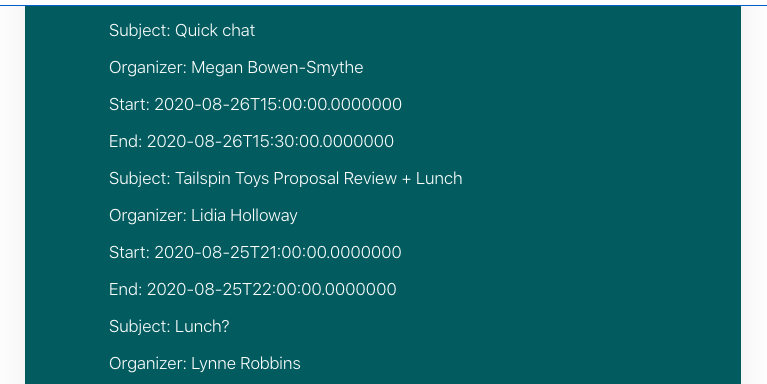

<!-- markdownlint-disable MD002 MD041 -->

Das SharePoint-Framework stellt die [MSGraphClient](https://docs.microsoft.com/javascript/api/sp-http/msgraphclient?view=sp-typescript-latest) für das tätigen von Anrufen an Microsoft Graph bereit. Mit dieser Klasse wird die [Microsoft Graph-JavaScript-Client Bibliothek](https://github.com/microsoftgraph/msgraph-sdk-javascript)umgebrochen und mit dem aktuell angemeldeten Benutzer vorab authentifiziert.

Da die vorhandene JavaScript-Bibliothek umbrochen wird, ist die Verwendung identisch, und Sie ist vollständig kompatibel mit den Microsoft Graph-Beschreibungen.

## <a name="get-the-users-calendar"></a>Abrufen des Kalenders des Benutzers

1. Öffnen Sie **/src/Webparts/graphTutorial/GraphTutorialWebPart.TS** , und fügen Sie die folgenden `import` Anweisungen am Anfang der Datei hinzu.

    ```typescript
    import { MSGraphClient } from '@microsoft/sp-http';
    import * as MicrosoftGraph from '@microsoft/microsoft-graph-types';
    import { startOfWeek, endOfWeek, setDay, set } from 'date-fns';
    ```

1. Fügen Sie die folgende Funktion zur **GraphTutorialWebPart** -Klasse hinzu, um einen Fehler zu rendern.

    :::code language="typescript" source="../demo/graph-tutorial/src/webparts/graphTutorial/GraphTutorialWebPart.ts" id="renderGraphErrorSnippet":::

1. Fügen Sie die folgende Funktion hinzu, um die Ereignisse im Kalender des Benutzers zu drucken.

    ```typescript
    private renderCalendarView(events: MicrosoftGraph.Event[]) : void {
      const viewContainer = this.domElement.querySelector('#calendarView');
      let html = '';

      // Temporary: print events as a list
      for(const event of events) {
        html += `
          <p class="${ styles.description }">Subject: ${event.subject}</p>
          <p class="${ styles.description }">Organizer: ${event.organizer.emailAddress.name}</p>
          <p class="${ styles.description }">Start: ${event.start.dateTime}</p>
          <p class="${ styles.description }">End: ${event.end.dateTime}</p>
          `;
      }

      viewContainer.innerHTML = html;
    }
    ```

1. Ersetzen Sie die vorhandene `render`-Funktion durch Folgendes.

    :::code language="typescript" source="../demo/graph-tutorial/src/webparts/graphTutorial/GraphTutorialWebPart.ts" id="renderSnippet":::

    Beachten Sie, was dieser Code tut.

    - Es wird verwendet `this.context.msGraphClientFactory.getClient` , um ein authentifiziertes **MSGraphClient** -Objekt abzurufen.
    - Der `/me/calendarView` Endpunkt wird aufgerufen, und die `startDateTime` Parameter-und `endDateTime` Abfrageparameter werden auf den Anfang und das Ende der aktuellen Woche festgesetzt.
    - Es wird verwendet, `select` um die zurückgegebenen Felder zu begrenzen und nur die Felder anzufordern, die die APP verwendet.
    - Sie verwendet `orderby` , um die Ereignisse nach ihrer Startzeit zu sortieren.
    - Er verwendet `top` , um die Ergebnisse auf 25 Ereignisse zu begrenzen.

## <a name="deploy-the-web-part"></a>Bereitstellen des Webparts

1. Führen Sie die folgenden beiden Befehle in der CLI aus, um das Webpart zu erstellen und zu verpacken.

    ```Shell
    gulp bundle --ship
    gulp package-solution --ship
    ```

1. Öffnen Sie den Browser, und wechseln Sie zum SharePoint-App-Katalog des Mandanten. Wählen Sie auf der linken Seite das Menüelement **Apps für SharePoint** aus.

1. Laden Sie die Datei **./SharePoint/Solution/Graph-Tutorial.sppkg** hoch.

1. Bestätigen Sie in der Aufforderung **Do You Trust...** , dass in der Aufforderung die vier Microsoft Graph-Berechtigungen aufgelistet sind, die Sie in der Datei **package-solution.jsfür** festgelegt haben. Wählen Sie **Diese Lösung für alle Websites in der Organisation verfügbar machen** aus, und wählen Sie dann **Bereitstellen** aus.

1. Wenn Sie die Graph-Berechtigungen für Ihr Webpart noch nicht genehmigt haben, müssen Sie dies jetzt tun.

    1. Wechseln Sie zum [SharePoint Admin Center](https://admin.microsoft.com/sharepoint?page=classicfeatures&modern=true) mithilfe eines Mandanten Administrators.

    1. Wählen Sie im Menü links die Option **erweitert** und dann **API-Zugriff** aus.

    1. Wählen Sie die ausstehenden Anforderungen aus dem Paket **Graph-Tutorial-Client-Side-Solution** aus, und wählen Sie **genehmigen** aus.

        

## <a name="test-the-web-part"></a>Testen des Webparts

1. Wechseln Sie zu einer SharePoint-Website, auf der Sie das Webpart testen möchten. Erstellen Sie eine neue Seite, auf der das Webpart getestet werden soll.

1. Verwenden Sie die Webpart-Auswahl zum Suchen des **GraphTutorial** -Webparts und zum Hinzufügen des Webparts zur Seite.

    

1. Eine Liste der Ereignisse für die aktuelle Woche wird im Webpart gedruckt.

    
