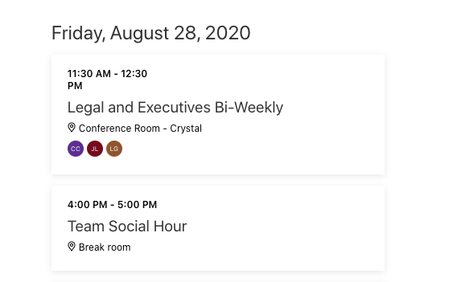

<!-- markdownlint-disable MD002 MD041 -->

In diesem Abschnitt aktualisieren Sie das Webpart, um dem Benutzer das Hinzufügen eines Ereignisses zu seinem Kalender für die wöchentliche soziale Stunde des Teams zu ermöglichen. In diesem Szenario hat das Team eine wöchentliche soziale Stunde um 16.00 Uhr am Freitag.

1. Öffnen Sie **./src/Webparts/graphTutorial/GraphTutorialWebPart.TS** , und ersetzen Sie die vorhandene `addSocialToCalendar()` Methode durch Folgendes.

    :::code language="typescript" source="../demo/graph-tutorial/src/webparts/graphTutorial/GraphTutorialWebPart.ts" id="addSocialToCalendarSnippet":::

    Überprüfen Sie die Funktionsweise dieses Codes.

    - Er bestimmt den nächsten kommenden Freitag und konstruiert ein **Datum** für 16.00 Uhr an diesem Tag.
    - Es wird ein neues **Microsoft Graph. Event** -Objekt erstellt, wobei der Anfang auf den Wert des **Datums** und das Ende eine Stunde später festzulegen ist.
    - Es verwendet die **MSGraphClient** , um das neue Ereignis an den `/me/events` Endpunkt zu senden.
    - Das Webpart wird erneut gerendert, sodass die Ansicht mit dem neuen Ereignis aktualisiert wird.

1. Erstellen Sie das Webpart, packen Sie es erneut hoch, und aktualisieren Sie dann die Seite, auf der Sie getestet werden.

1. Klicken Sie auf die Schaltfläche **Team soziale Netzwerke hinzufügen** . Nachdem die Seite aktualisiert wurde, führen Sie einen Bildlauf nach unten bis Freitag durch, und suchen Sie nach dem neuen Ereignis.

    
